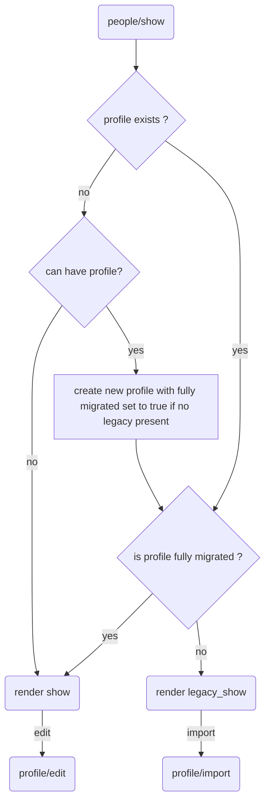

# Notes about the old people application and migration
People have to main main sources of data:
  1. official personal data (name, accreditations, etc.) from read-only DBs and APIs.
  2. people-specific biography / curriculum vitae data that can be edited by the user

In the old applications, bio data were organized in _boxes_. Two main types of
boxes and three special cases: 
1. title + free text
  - Biography (pos B, undeletable, frozen title)
  - Biography free (pos B) e.g. "mission", "current work"
  - Free Contact boxes (pos K) is added below the social ids zone on the left
  - Research (pos R)
  - Teaching related free content (pos T)
2. specialized models (the box is a list of instances of the model)
  - Education (model Education/edu, pos B, fields: title, description, institution, dates)
  - Professional Course (model Experience/parcours, pos B, fields: title, description, institution, dates)
  - Awards (model Award/awards, pos B, fields: title, description, url, dates)
  - Selected Publications (model Publication/publications, pos P, fields: authors, title, revue, link)
  - Achievements (model Achievement/achievements, system V, pos B, fields: category, description, url, year
4. Infoscience Publications are currently stored in the boxes table but should be moved to and _ad-hoc_ model because they have a special logic and caching mechanism. The `src` column in `boxes` is actually used exclusively by this model.
5. The `profresearch` table is full of interesting infos but, for some reason, it is no longer editable and only used as a fallback for awards when those are not present.

Boxes are divided in blocks
 - Contact block (pos K)
 - Biography block (pos B) also includes Education and Professional Course
 - Publication block (pos P)
 - Research block (pos R)
 - Teaching block (pos T)


```perl
my $systemboxes = {
  bio => {
    label => {
      fr  => 'Biographie',
      en  => 'Biography',
    },
    position => 'B',
    sys => '',
  },
  edu => {
    label => {
      fr  => 'Formation',
      en  => 'Education',
    },
    position => 'B',
    sys => 'E',
  },
  parcours => {
    label => {
      fr  => 'Parcours professionnel',
      en  => 'Profesional Course',
    },
    position => 'B',
    sys => 'C',
  },
  achievements => {
    label => {
      fr  => 'Réalisations annuelles',
      en  => 'Annual Achievements',
    },
    position => 'B',
    sys => 'V',
  },
  awards => {
    label => {
      fr  => 'Récompenses',
      en  => 'Awards',
    },
    position => 'B',
    sys => 'A',
  },
  publ => {
    label => {
      fr  => 'Sélection de publications',
      en  => 'Selected publications',
    },
    position => 'P',
    sys => 'P',
  },
};
my @systemBoxesOrder = ('bio', 'edu', 'parcours', 'awards', 'publ', 'achievements');
sub initBoxes {
  my $self   = shift;
  my $sciper = shift;
  my $cvlang = shift;
  return unless $sciper && $cvlang;
  my $dbh    = $self->{dbh};
  my $ordre = 0;
  foreach my $box_type (@systemBoxesOrder) {
    next unless $box_type;
    my $box = $systemboxes->{$box_type};
    my $sql = qq{
      insert into cv.boxes set
        sciper=?,
        cvlang=?,
        label=?,
        position=?,
        sys=?,
        ordre=?
    };
    my $sth = $dbh->prepare( $sql ) or die "** ERR people prepare :$sql: $DBI::errstr\n";
    $sth->execute ($sciper, $cvlang, $box->{label}->{$cvlang}, $box->{position}, $box->{sys}, $ordre) or die "** RR execute : $DBI::errstr\n$sql\n";
    $ordre++;
  }
}
```

## Importing boxes
Boxes contain all sort of crap. It will be hard to auto-migrate. 
I think we should do it by hand (e.g. @ SDF) and only for currently active people.


## New Structure
### First attempt
 * Section: the various sections of the Cv page with localized title.
   - title_en
   - title_fr
   - label
   - zone
   - position
   - show_title
   - create_allowed
   - have_many :boxes
   - has_many :model_boxes
 * ModelBox: the standard boxes that will be used as templates for the boxes
   that will be automatically added to each profile. 
   - label
   - locale
   - title
   - show_title
   - position
   - belongs_to :section
 * Box: the actual boxes for the user profiles.  
   - locale
   - title
   - show_title
   - frozen
   - kind
   - visible
   - position
   - belongs_to :cv
   - belongs_to :section

Pros: 
 - similar to the current implementation;
 - extensible multilanguage (more languages can be added later)
Cons:
 - not very general wrt the fact of having different types of boxes (e.g. education, awards, etc)
 - the fact of creating the boxes from model boxes for each profile will introduce a lot of useless lines in the database and complicates testing. It is probably better to only create the used boxes and allow to chose the template upon creation.


 


## Migration

Migrating garbage is not fun. Possible alternatives are
 1. keep as much as the garbage unchanged and hope for the best;
 2. hire workforce to manually copy the current profiles (at least for profs and VIP)
 3. _one shot carryover_ we start the new application for everybody but we keep serving the legacy data with a dedicated view untill the profile owner tries to edit his profile. At that point we fire a "first import" view where we prefill data with what we can and let the user do the rest. The problem is that the thing is easy if the user fixes all the records at once (stays on the edit page as long as all the records are fixed and saved) but otherwise we have to keep track of which records were imported.



* first visit of any editable profile will create it by default. 
* before create callback check if profile needs to be migrated (that is, legacy data exists);
* "can have profile?" needs api but will be cached
* if user logged-in and profile not migrated a message will be shown with the invitation to do the migration job and a link to profile/import
* For records not containing rich text, we can create new objects copying from legacy and append them to the list of already migrated real objects. What about objects with rich text ?
* implement `from_legacy` class method in all models and add reference to legacy id to enable deletion `after_create`.
* remove button just acts on the dom

Tables:

| table        | auto  | rich text? | notes |
|--------------|-------|------------|------------------------------------------------------------------|
| accreds      | yes   | no         |  |
| boxes        | no    | possibly   |  |
| common       | yes   |            | merged into profile |
| cv           | no    | yes        | just 3 rich text boxes (curriculum=bio, expertise, mission) |
| edu          | no    | no         | but not too much crap (dates could be managed) |
| parcours     | no    | no         | quite a garbage container (field column is actually description) |
| profresearch |       |            | no longer used  |
| publications | yes   | no         |  |
| redirects    | yes   | no         |  |
| research_ids | maybe | no         |  |
| teaching_act | ??    |            | possibly no longer used. Check! |

There are ~10k rich text boxes with content (see `lib/tasks/cvcleanup.rake`)


