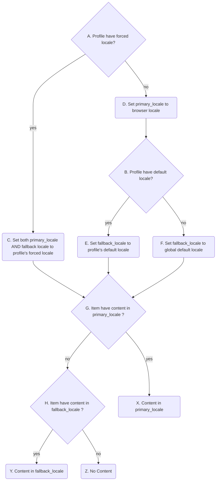

# Multilanguage support

## Current implementation status
Current version only support two languages: french and english. We start by doing the same with the idea of adding more languages in the future. The problem is how to make the UI usable.

For two languages we decided to have each field repeated (e.g. instead of `title`, we have `title_en`, and `title_fr`) and statically visible in editing forms. Forms grow fat but the user gets immediate feedback about missing translations. This approach could be extended to 3, possibly 4 languages but for sure not more than 4. 

I have tried to put most of the language-related functions in the `Translatable` concern.

In case we will have to rething the UI. An option would be to leverage JS and create fields with name that changes depending on the language selected from a dropdown menu. While making the forms possibly lighter, it would rely on the user chosing the correct language which is not ideal.

In the legacy version, the user can force his profile to be displayed only in a given language even when a translation exists in the language of the reader. PO asked for this feature to be kept. 

Here is how the content translation is chosen (in index/show views):

